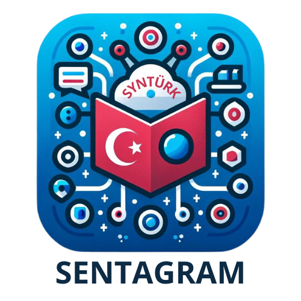
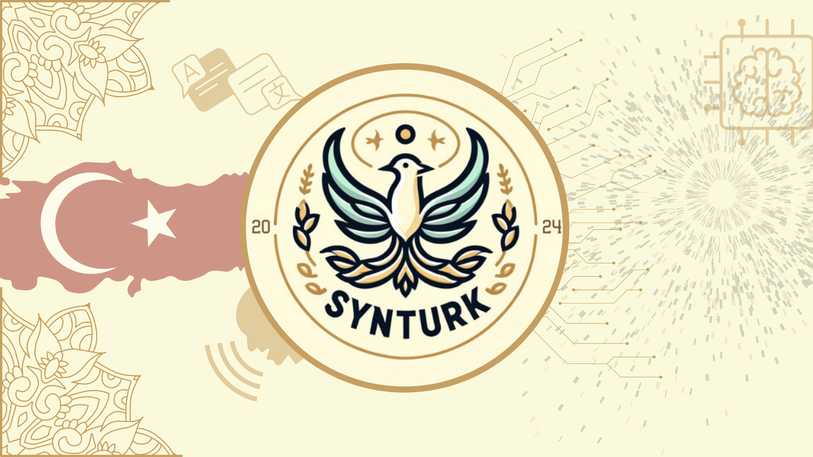

# synturk-sentagram

# SENTAGRAM



**SENTAGRAM**, Türkçe cümlelerin dil bilgisi ögelerini ayırmak ve analiz etmek için geliştirilmiş yenilikçi bir doğal dil işleme (NLP) uygulamasıdır. Proje, BERTürk tabanlı bir model kullanarak cümlelerdeki özneleri, yüklemleri, tümleçleri ve diğer dil bilgisi yapılarını ayırır ve bu ögeler hakkında detaylı bilgi sağlar.

Projenin sunumu için [tıklayınız.](https://drive.google.com/file/d/1F4vrl1XX8UuZ8CTVyC1D9QhtEtjIlxRm/view?usp=sharing)

Projenin demo videosu için [tıklayınız.](https://drive.google.com/file/d/12B-Wk74o990uwJqxI_y03_6hI56cQmWS/view?usp=sharing)

## Proje Hakkında

**SENTAGRAM**, dil bilgisi ögelerinin doğru bir şekilde analiz edilmesini sağlayan, Türkçe diline özgü karmaşıklıkları ele alan bir uygulamadır. Bu proje, Türkçe dil bilgisi kurallarını öğreten ve dilin doğru kullanımını teşvik eden bir araç olarak geliştirilmiştir.

## Motivasyonumuz

Bu projeyi geliştirirken internet üzerinde bize yardımcı olabilecek herhangi bir veri seti maalesef ki bulamadık. Bu konu hakkında bize öncülük edebilecek bir projeye de rastlayamadık. Türkçemizin zenginliklerini düşününce bizim için zorlu olan bu süreçte, özgün bir proje çıkarma amacıyla yola çıktık.
Türkçe'nin herkes tarafından doğru kullanılması, dil bilgisi kurallarımızın öğrenilmesi ve bilinmesi bizim en büyük hedefimizdir. 

## Özellikler

- **Dil Bilgisi Analizi:** Türkçe cümleleri dil bilgisi kurallarına göre ayrıştırır ve özneleri, yüklemleri, tümleçleri gibi dil bilgisi ögelerini belirler.

- **Veri Seti:** Proje için özgün olarak oluşturulmuş veri seti; çeşitli haber siteleri, test kitapları ve makalelerden elde edilmiştir.

- **Model Eğitimi:** BERTürk tabanlı model kullanılarak token sınıflandırma yapılmıştır. Model, Optuna kullanılarak hiperparametre optimizasyonu ile en iyi performansı sağlamak üzere optimize edilmiştir.

- **Performans Metrikleri:** Modelin doğruluğunu ve F1 skorunu değerlendirmek için çeşitli metrikler kullanılmıştır.

## Kullanılan Teknolojiler

- **Python 3.6+**
- **Hugging Face Transformers**
- **BERTürk Modeli**
- **Optuna (Hiperparametre Optimizasyonu)**
- **Flask** (Web arayüzü için)

## Kurulum

### Gereksinimler:

- Python 3.6+
- transformers: Hugging Face'in doğal dil işleme modelleri için kullanılan kütüphane.
- datasets: Verileri yüklemek ve işlemek için kullanılan kütüphane.
- evaluate: Model performansını değerlendirmek için kullanılan kütüphane.

### Yükleme

Gerekli Python paketlerini yüklemek için:

```bash
pip install transformers datasets evaluate
```

## Kullanım

### Model Yükleme ve Test:

Modeli test etmek için aşağıdaki örneği kullanabilirsiniz. Bu kod, bir cümleyi modelle test eder ve tahmin edilen etiketleri yazdırır.

Model için [tıklayınız.](https://huggingface.co/synturk/sentagram)

```python
from transformers import AutoTokenizer, AutoModelForTokenClassification
import torch

# Model ve tokenizer'ı yükle
tokenizer = AutoTokenizer.from_pretrained("synturk/sentagram")
model = AutoModelForTokenClassification.from_pretrained("synturk/sentagram")

# Test cümlesi
text = "SYNTÜRK yarışmayı kazandı."

# Cümleyi tokenize et
inputs = tokenizer(text, return_tensors="pt")

# Model ile tahmin yap
with torch.no_grad():
    outputs = model(**inputs)
    predictions = torch.argmax(outputs.logits, dim=2)

# Sonuçları yazdır
print(predictions)
```

## Performans

|Training Loss|Validation Loss|Precision|Recall  |F1 Score|Accuracy|
|:-----------:|:-------------:|:-------:|:------:|:------:|:------:|
|0.016700     | 0.479245      |0.911349 |0.911826|0.911588|0.935395| 

## Gelecek Planları

SENTAGRAM şu an için yalnızca cümlelerin dil bilgisi ögelerini ayırmakta ve analiz etmektedir. Ancak, gelecekte projeyi daha fazla dil bilgisi özellikleri ile genişletmeyi planlıyoruz. Bu özellikler arasında gelişmiş dil bilgisi kurallarının analizi, daha karmaşık cümle yapılarını tanıma ve dil bilgisi hatalarının otomatik düzeltilmesi gibi işlevler yer alacaktır.

## Katkıda Bulunma

Proje üzerinde katkıda bulunmak isterseniz, lütfen bir fork oluşturun ve değişikliklerinizi pull request olarak gönderin. Proje ile ilgili herhangi bir sorunuz varsa, bir issue açabilirsiniz.

## Yardım ve Destek

Proje ile ilgili yardım almak isterseniz, lütfen [issue tracker](https://github.com/Syntax-Turkiye/sentagram/issues) üzerinde bir sorun bildirin veya katkıda bulunanlar ile iletişime geçin.

## Lisans

Bu proje, Apache License 2.0 ile lisanslanmıştır. Daha fazla bilgi için `LICENSE` dosyasına göz atabilirsiniz.

## Katkıda Bulunanlar



SENTAGRAM projesi, SYNTÜRK takımı tarafından geliştirilmiştir:

- [Zülfükar MİNAZ](https://github.com/zlfkrmnz/) (Takım Kaptanı)
- [Ayşe Selin ALTUNTAŞ](https://github.com/selinaltuntas)
- [Ilgın Eylül YILDIZ](https://github.com/ilgineyildiz)
- [Berk İÇLİ](https://github.com/Berkowhiskey)
- [Volkan ALTINTAŞ](https://github.com/VolkanAltintas) (Takım Danışmanı)

Takım tanıtım dosyası için [tıklayınız.](https://drive.google.com/file/d/1eHSHKr_Cdyzn9eVl7XBcKmaZ4OyrY1hy/view?usp=sharing)